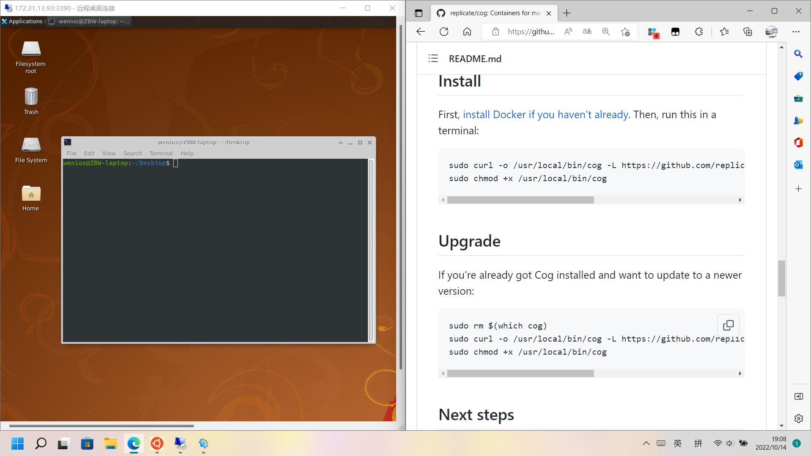

# zbw：问题发现与解决

- ### 问题1：团队协作
  - 鬓影工程量较大，通过QQ协作效率低，文件杂乱
  - 修改代码容易发生冲突
 
- ### 解决方案
  - 建立GitHub私有仓库进行协作

- ### 问题2：算力不足，训练时间长
  - 鬓影参考HairClip，训练要求算力较高
  - e4e提供的训练用照片多达上万张，而我们的规模较小

- ### 解决方案
  - 注册使用AutoDL的云GPU，创建实例，建立与本地Pycharm的远程连接关系
  - 在云服务器终端配置环境，运行项目
  - 将原有数据集进行合理筛选，择出1000张效果合理的人脸图片，降低训练规模

- ### 问题3：发型图片收集
  - 目前没有公开现成的古装发型数据集
  - 网络爬取的图片大多不符合算法需求图像尺寸格式1024*1024
  - 图像需要正脸，发型完整

> 收集的古装照样例
> 
> 
> 
> 

- ### 解决方案
  - 编写python程序对爬取的图片进行处理
    - 人脸对齐
    ~~~
    def align_face(image_array, landmarks):
    # 左右眼位置获取
    left_eye = landmarks['left_eye']
    right_eye = landmarks['right_eye']
    # 计算左右眼位置的平均点
    left_eye_center = np.mean(left_eye, axis=0).astype("int")
    right_eye_center = np.mean(right_eye, axis=0).astype("int")
    # 计算角度
    dy = right_eye_center[1] - left_eye_center[1]
    dx = right_eye_center[0] - left_eye_center[0]
    angle = math.atan2(dy, dx) * 180. / math.pi
    # 计算左右眼的中心
    eye_center = ((left_eye_center[0] + right_eye_center[0]) // 2,
                  (left_eye_center[1] + right_eye_center[1]) // 2)
    # 按角度旋转图像
    rotate_matrix = cv2.getRotationMatrix2D(eye_center, angle, scale=1)
    rotated_img = cv2.warpAffine(image_array, rotate_matrix, (image_array.shape[1], image_array.shape[0]))
    return rotated_img, eye_center, angle
    ~~~
    - 旋转坐标
    ~~~
    def rotate(origin, point, angle, row):
    x1, y1 = point
    x2, y2 = origin
    y1 = row - y1
    y2 = row - y2
    angle = math.radians(angle)
    x = x2 + math.cos(angle) * (x1 - x2) - math.sin(angle) * (y1 - y2)
    y = y2 + math.sin(angle) * (x1 - x2) + math.cos(angle) * (y1 - y2)
    y = row - y
    return int(x), int(y)
    ~~~
    - 旋转landmark
    ~~~
    def rotate_landmarks(landmarks, eye_center, angle, row):
    rotated_landmarks = defaultdict(list)
    for facial_feature in landmarks.keys():
        for landmark in landmarks[facial_feature]:
            rotated_landmark = rotate(origin=eye_center, point=landmark, angle=angle, row=row)
            rotated_landmarks[facial_feature].append(rotated_landmark)
    return rotated_landmarks
    ~~~
    - 裁剪并调整尺寸为1024*1024
    ~~~
    def corp_face(image_array, landmarks):
    eye_landmark = np.concatenate([np.array(landmarks['left_eye']),
                                   np.array(landmarks['right_eye'])])
    eye_center = np.mean(eye_landmark, axis=0).astype("int")
    lip_landmark = np.concatenate([np.array(landmarks['top_lip']),
                                   np.array(landmarks['bottom_lip'])])
    lip_center = np.mean(lip_landmark, axis=0).astype("int")
    mid_part = lip_center[1] - eye_center[1]
    top = eye_center[1] - mid_part * 16 / 5
    bottom = lip_center[1] + mid_part * 7 / 5

    w = bottom - top
    x_min = np.min(landmarks['chin'], axis=0)[0]
    x_max = np.max(landmarks['chin'], axis=0)[0]
    x_center = (x_max - x_min) / 2 + x_min
    left, right = (x_center - w / 2, x_center + w / 2)

    pil_img = Image.fromarray(image_array)
    left, top, right, bottom = [int(i) for i in [left, top, right, bottom]]
    cropped_img = pil_img.crop((left, top, right, bottom))
    cropped_img = np.array(cropped_img)
    cropped_img = cv2.resize(cropped_img, (1024, 1024), interpolation=cv2.INTER_CUBIC)
    return cropped_img, left, top
    ~~~

> 处理后的效果图
> 
> 
> 
> 

- ### 问题4：pridict环境搭建
  - 运行pridict需要配置[Cog](https://github.com/replicate/cog)环境
  - Cog环境适宜在Linux配置
  - ubantu上的github被墙的更明显
  - pridict整体数据较大，跨系统传输问题

- ### 解决方案
  - 在windows11上安装ubantu子系统
  >  相对于双系统配置更简单，使用更安全；相对于虚拟机能更大程度上使用本机的硬件，能配置CUDA
  >
  > 
  - 修改host，解决ubantu上github的网络问题
  - 在子系统完成Cog的基本配置

